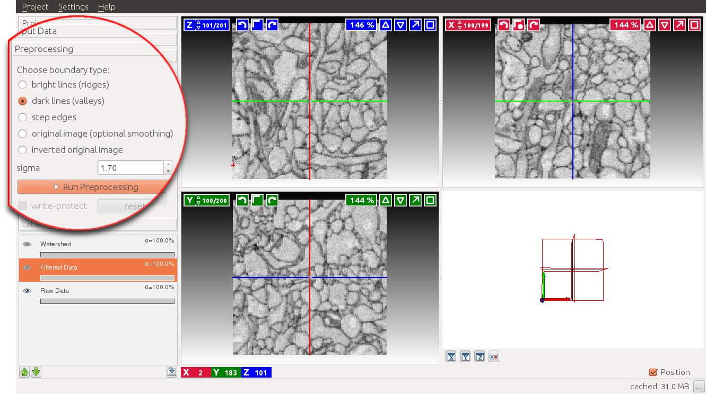
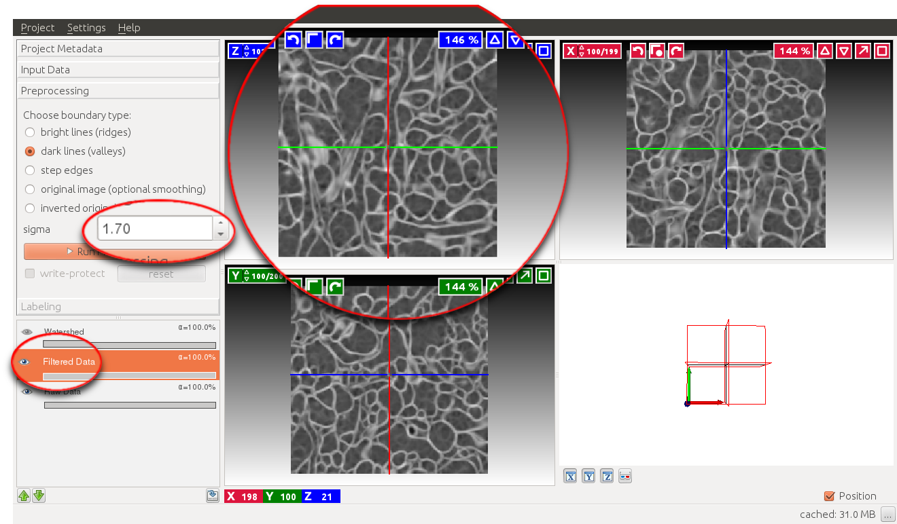
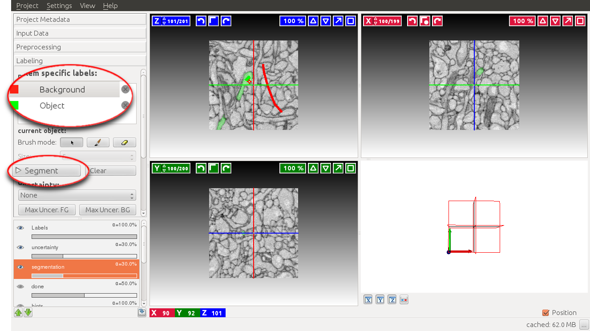
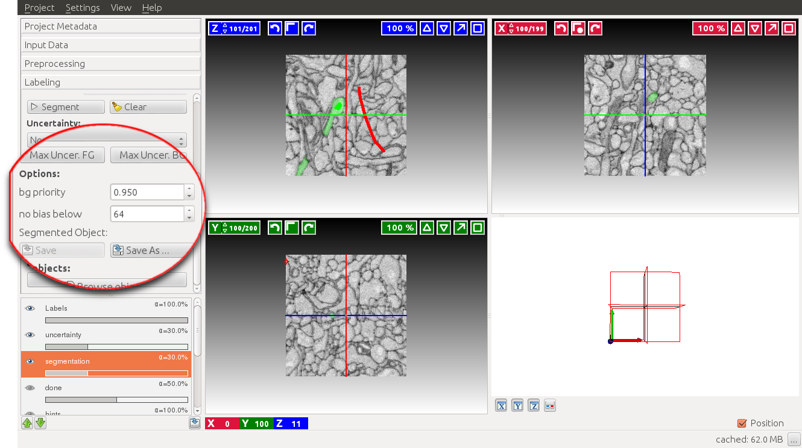
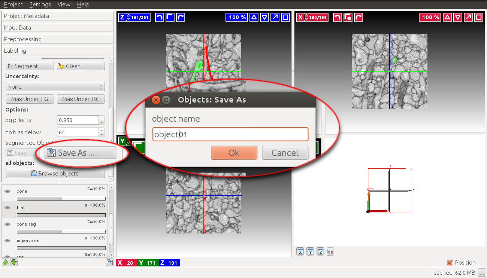
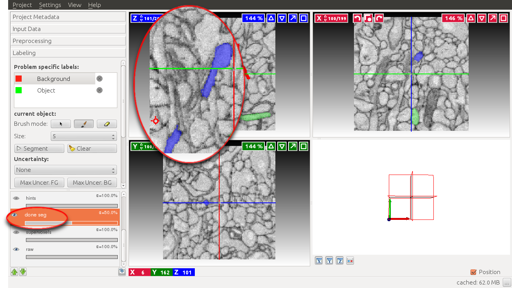
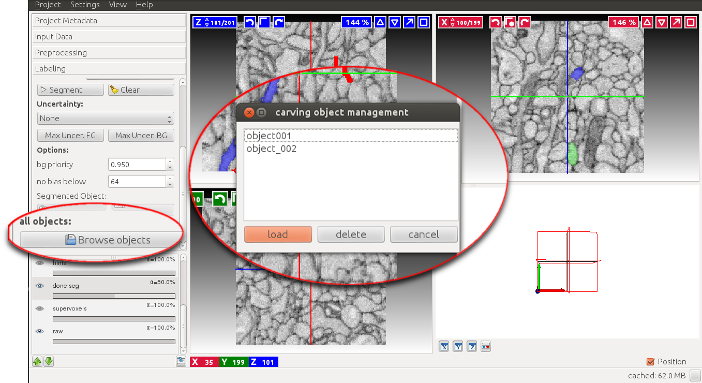
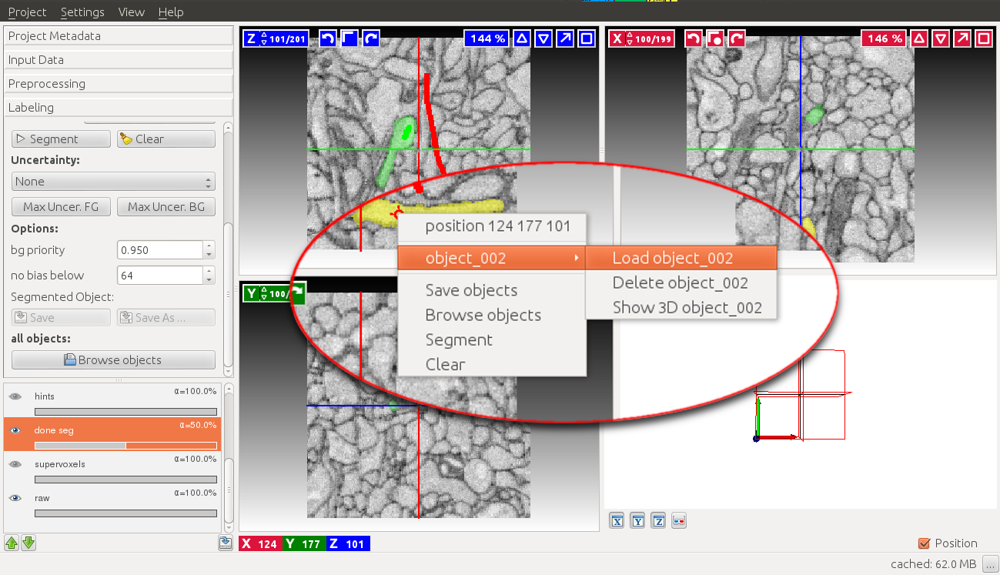

# Carving
## How it works, what it can and cannot do

The seeded watershed algorithm is an image segmentation algorithm for
interactive object carving from image data. The algorithm input are user given
object markers (see example below) for the inside (green) and outside (red) of
an object.  From these markers an initial segmentation is calculated that can
be refined interactively. The seeded watershed relies on discernible object
boundaries in the image data and not on inner appearance of an object like for
example the classification workflow.
      

While the
[Classification module]({{site.baseurl}}/documentation/pixelclassification/pixelclassification.html)
is useful for segmenting objects with discernible brightness, color
or textural differences in comparison to their surroundings, the carving
module's purpose is to aid in the extraction of objects from images that are
only separable by their boundary - i.e. objects that do not differ from the
rest of the image by their internal appearance.

      
From the two images displayed to the right, the left image is clearly
more suitable for the classification module since the cell cores have a
strong red color component in comparison to their surrounding. The right
image on the other hand is a good example for the applicability of the
seeded watershed segmentation (the problem setting is the segmentation of
a single cell from electron microscopy image of neural tissue) since the
neural nerveous cells have similar color distributions but can be
separated by the dark cell membranes dividing them. (NOTE: the seeded
watershed **could** also be applied to segment individual cell cores
in the left image interactively, but in such a case where there is a
clear visible difference between the objects of interest and their
surrounding the classification module is a better choice.)

The algorithm is applicable for a wide range of segmentation problems that
fulfill these properties. In the case of data where the boundaries are not
clearly visible or in the case of very noisy data, a boundary detection filter
can be applied to improve results - this is the topic of the following section.

## Constructing a good boundary map

Assuming the user has already created or loaded an existing
ilastik project and added a dataset, the first step is to switch to the **Preprocessing Applet**
where the filter selection and computation are performed.

Here the user can select from several different boundary types.
* Bright lines: this option should be selected if the boundaries in the image appear as bright lines.
* Dark lines: this option should be selected if the boundaries in the image appear as dark lines.
* Step edges: this option should be selected if the boundary in the image appears as a transition from a bright to a dark region.
* Original image: if the loaded image is already a boundary map, where bright pixels correspond to an image boundary.
* Inverted Original image: if the loaded image is already a boundary map, where dark pixels correspond to an image boundary.

In the example image above, a good boundary choice would clearly be **Dark lines**.

To check if the computed boundaries visually correspond with the edges in the image the visibility of the **Filtered Data** layer
can be toggled by clicking on the small eye in that layer:

If the boundary map looks too noisy or overly smooth the size of the smoothing kernel needs to be changed with the **sigma** option.
The **Filtered Data** layer is updated when the user changes the size of the smoothing kernel. This setting should be changed
until a satisfactory boundary map is obtained.

When everything looks fine, the user can click on the **Run Preprocessing button** to calculate a sparse supervoxel graph of 
the image and boundary map which will speed up segmentation times.
      
**Note:** The preprocessing may take a long time depending on the the
size of the dataset. On a i7 2.4GHz computer a 500*500*500 3D dataset requires
15 minutes of preprocessing.

## Interactive Segmentation

After the necessary preprocessing the interactive segmentation of objects in the **labeling** applet is the next step.

Two different types of seeds exist, **Object seeds** and **Background seeds** - per default the background seed receives a higher priority such that the background seed is preferred in the case of ambiguous boundaries.

After marking the objects of interest with a object seed and the outside
with a background seed the button **Segment** can be clicked to obtain a seeded
watershed segmentation starting from the seeds.

The seeds can be refined by drawing markers, the currently active seed type can be selected 
on the left side by clicking on the corresponding seed.
To erase erroneous markers, the **Brush mode** (below the seeds) needs to be changed to the eraser to switch back to drawing mode 
the paint brush item has to be activated again.
 
Additional available interactions include:

- **Updating the segmentation:** Left click on button **Segment**
- **Erasing a brush stroke:** Change brush mode to eraser by clicking on the eraser button
- **Changing the active seed type:** Left Mouseclick on seed in the left-hand side seed list.
- **Changing the color of a seed type:** Right Mouseclick on the corresponding seed in the seed list and select **Change Color**.
- **Erasing all markers:** Click on the  **Clear**.button next to the segment button.
- **Exporting the current segmentation:** Right click on the **Segmentation Overlay** in the overlay widget and select **Export**.
      
To learn more about how to navigate the data (**scroll, change slice,
enable/disable overlays, change overlay capacity etc. **) please read the <a
href="/kategorien/20_Documentation/dateien/ilastik_carving_documentation/">Navigation
guide for ilastik 0.5</a>

## Advanced Options

The seeded watershed algrorithm of the module has some advanced options which
can be changed to obtain improved segmentations when the default settings are
not sufficient.

These additional options described below can be displayed by scrolling down
in the labeling applet on the left side.

- **BG priority** The bias is a parameter the affects how much the background is
  preferred in comparison to the other labels. A value smaller then 1.0 will
  lower the detected boundaries for the background seeds. Since the normal
  seeds still work on the original boundaries the background is preferred in
  case of ambigouity. Usually a value of around 0.95 yields good results, but
  sometimes playing with the parameter is a good way to improve segmentations
  without additional seeds.
- **No bias below** The threshold is a value that affects when the **BG priority**
  for the background will be applied. Normally the background seed is only
  preferred when the boundaries are sufficiently strong, i.e. > 64 (the
  boundaries in the image have values between 0 and 255). Usually it is not
  neccessary to change this parameter.
  

## Saving and loading segmented objects

Once the user has successfully segmented an object, the segmentation result
can be stored by clicking on the **Save As** button. A dialog will pop up that
asks for the objects name:

After saving an object, all existing markers will be removed to allow segmenting a new
object from scratch. To see which objects have already been segmented and saved the **Done** overlay
can be enabled by clicking on the little eye in that layer:

already segmented (and saved) objects will be highlighted to prevent segmenting something twice.

Sometimes it is neccessary to refine the segmentation of an already saved object. To do so, click
on the **Browse objects** button and load the corresponding object. 

Another way to load or delete a saved object is by right-clicking on the object displayed in the **Done** overlay
and selecting the corresponding option.

