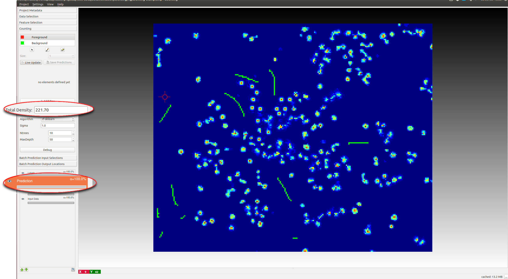
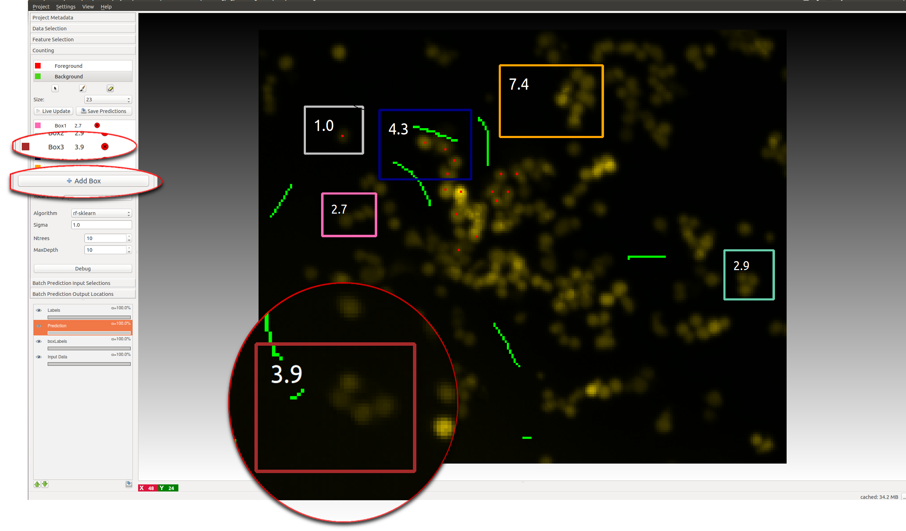

# Interactive Object Counting
## Overview, what it can and cannot do

The purpuse of this workflow is counting the number of objects in crowded scenes such as cells in microscopic images. 
When the density of objects is low it is possible to count objects by segmenting isolated individuals as in the [Object Classification workflow](../objectClassification). However, as the density of the objects increases the latter approach underestimates the true counts due to undersegmentation errors. 

This workflow offers a supervised learning strategy to object counting which is more robust to overlapping instances. It is appropriate for counting small, **overlapping objects with similar appearence** which are homegeneusly distributed over an uniform background. For example, in the figure below the first image contains large non overlapping objects with high variability in size and appereance and therefore is more suited to the [Object Classification workflow](../objectClassification), while the other images, containing small overlapping objects of the same type and thus are appropriate for the [Counting workflow](./counting.html).

In orderd to avoid the difficult task of segmenting individual objects, the workflow algorithm learns a real valued **object density** whose integral over any large image region gives the **count of objects** in that region. In the following figure, note that the integral of the smooth density is a real number close to the number of objects in the image.

To ease the burden on the user, we focused on minimizing the amount of input that has to be provided. The workflow input are user given markers (see example below) in the form of dots (red) for the object instances and brushstrokes for irrelevant background (green). A pixelwise mapping between local texture features and the object density is learned from these markers. This workflow offers the possibility to interectively refine the learned density by:

* Placing more markers for the foreground and background 
* Monitoring the object counts in image regions
* Constraining the number of objects in image regions 

## 1. Input Data
The user can provide either images (e.g. \*.png, \*.jpg and \*.tif) directly or pass hdf5 datasets. The image import procedure is detailed in LINKME". Please note that the current version of the Counting module is limited to handling **2D data only**, for this reason hdf5-datasets with a z-axis are not accepted. Only the training images requiring manual labeling have to be added in this way, the full prediction on a large dataset can be done via Batch Processing.

## 2. Feature Selection
Assuming the user has already created or loaded an existing ilastik project and added a dataset, as the other learning based workflows the first step for the user is to define the some features. Empirically we found that the same features of the pixel classification workflow (in particular Texture, Edge and Color) provide good performance in case of blob like objects such as cell.
It is appropriate to match the scale of the object with the size of the features. For further details please refer to LINKME.

## 3. Interactive counting
Similarly to the other modules, annotations are are done by painting while looking at the raw data and the result of the algorithm can be interactively refined while beeing in **live-update** mode. However, unlike the [Pixel Classification workflow](../pixelClassification), where only user brushes are supported, in the Counting workflow the user has a broader range of possible interactions which can be grouped into two categories:

* **Dotting** the object instances and **Brushing** over the background 
* **Boxing** image regions

### Dotting/Brushing Interaction Mode
This is tipically the first interaction with the core of the workflow. The purpose of this interaction model is to provide the classifier with examples for the object density values and examples for the background. 

To begin placing a dot just click on the red **Foreground** label. Objects instances have to be marked by user dots which have to be placed close to the center of the objects. Given the user dotted annotations, a smooth training density is derived by placing a Gaussian at the location of each annotation. The size of the Gaussian is a user parameter **Sigma** which should roghly match the object size. To help deciding an appropriate value for this parameter you will see the that the size of the **crosshair-cursor** changes accordingly to the chosen sigma.NOTE: Large values for sigma can heavily impact the required computation time: consider a to use a different approach, such as the [Object Classification workflow](../objectClassification) if this parameter has to be chosen larger than 5.

IMAGE: Good sigma/dot, bad sigma/dot

Background labelling happens exactly as in the [Pixel Classification workflow](../pixelClassification). To activate this interction click on the green **Background** label and give broad strokes, marking unimportant areas or regions where the predicted density should be close to 0. You can set the size of the brush from the dialog shown in the figure below.

IMAGE: Showing different controls for labeling with the brush

### Boxing Interaction Mode
This interaction takes place typically after that the user has trained a classifier giving examples of foreground and background. Boxes are used to **measure the predicted object count** over an image region and get a general feeling for the quality of the prediction.
**Advanced usage** of the boxes is explained in the Support Vector Regression section.

After that the prediction has been computed for the first time the **Prediction Layer** should appear in the layerstack and the **predicted total density** of the image should be updated.

The user can start placing boxes by clicking on the **add Boxes** button and drawing the box region on the image. The new box will be added automatically to the **Box List**.
Boxes show the object count for the region on the upper right corner and on the right of the box name in the Box List.
Boxes can be:
* **Selected and Moved**: to select a particular box you can hoover over the box with the mouse or select the box row in the Box List. The box will change color once selected. To move a box, drag the object in a different position while pressing the `Ctrl` key .
* **Resized**: when selecting a box it will show 2 resize handles at its borders. 
* **Deleted**: to delete a box either click on the delete button on the Box List or press `Del` while selecting the box
* **Configured**: you can configure the appearence (color,fontsize,fontcolor etc.. ) of each individual box by clicking at the row of the box and opening the Box Interaction Dialog.

## 3. Algorithms
**Two different regression algrotihms** are currently supportd by the Counting workflow depending on the availability of CPLEX on the machine where ilastik is intalled. We expose the most important and well-known parameters for our algorithms to the advanced user, details are given below. 

### Random Forest
This approach uses a Random Regression Forest as regression algorithm. 
In general it requires more labels to give correct results over several images, however it is more robust to inhomogeneus background.

The implementeation of the random regression forest is based on <a href = "http://scikit-learn.org/stable/"> sklearn</a>.
#### Advanced parameters
The forest parameters exposed to the user are:
* **Ntrees** Number of trees in the forest
* **MaxDepth** maximum depth of each individual tree.

IMAGE: Effect of different parameters

### Support Vector Regression
Requires Gurobi
Slower
Better generalization
Can offer additional type of label via Box constraints
-Box constraints not strict
#### Box Constraints
Box constraints offer an easy way to provide counts for a region, while not having to label every instance individually.

#### Advanced parameters
C: How much impact should individual and box errors do compared to w itself, this will likely only change results if you set C to low values.
epsilon: The amount of error that will be tolerated for individual pixels, this regularizes the result. 
though the defaults should already create good results.

## 4. Exporting results
Possible to save the regressor. Will be loaded again, can do prediction directly if parameters and labels untouched
Can also save prediction itself. If you want to export the results for a single image, use exportLayerDialog.

## 5. Batch Processing
For large-scale prediction, first train regressor, then add input images, then press export all.

## 6. References

