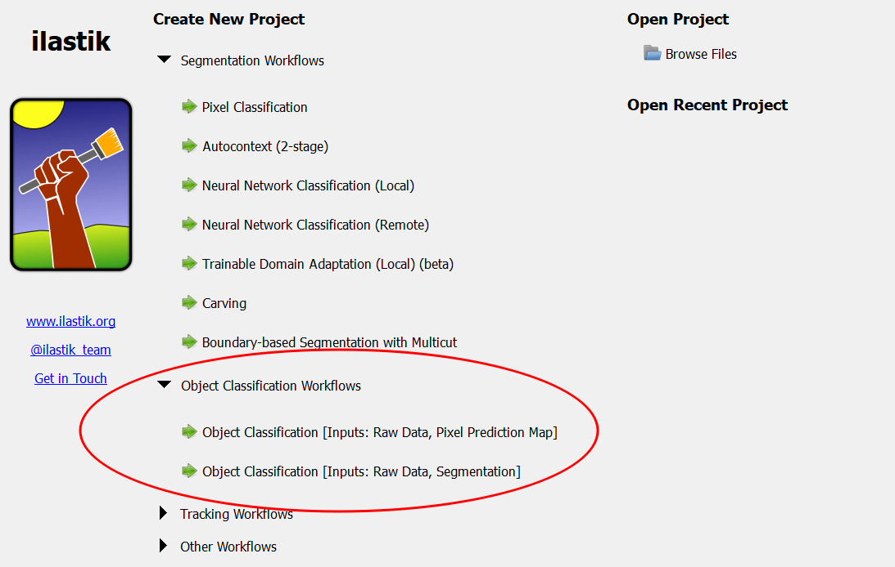
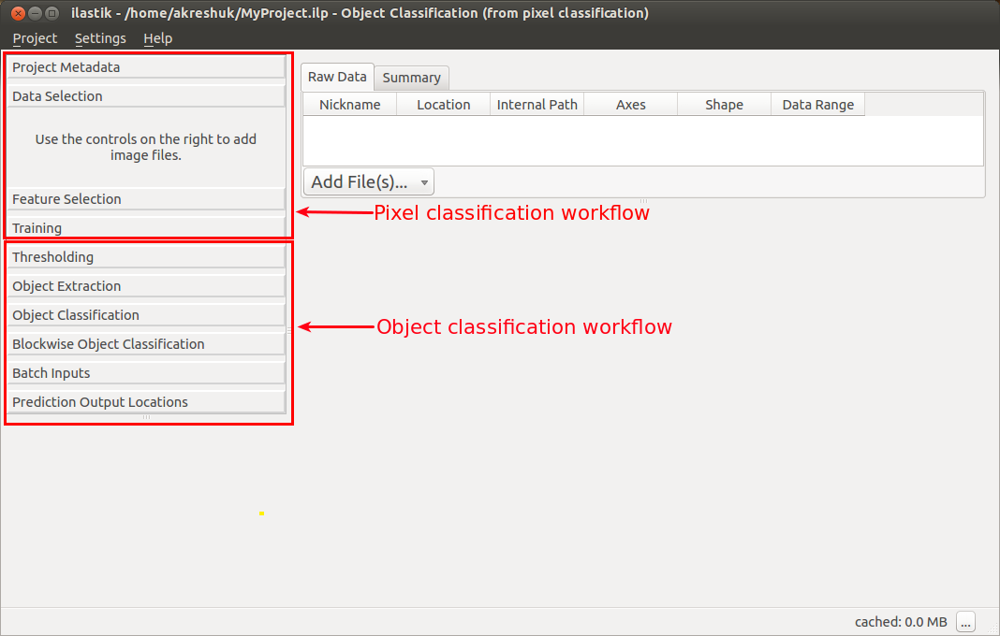
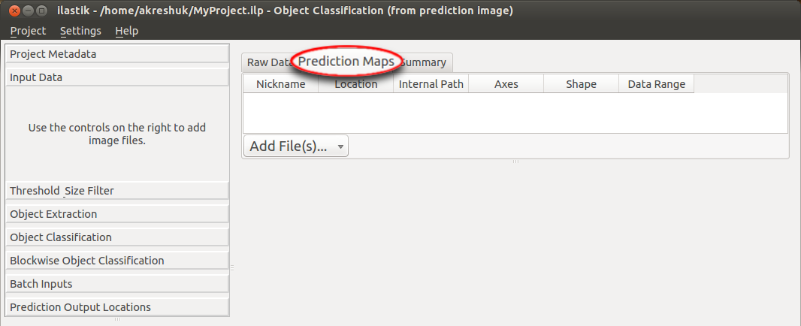
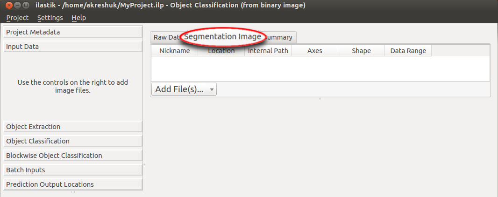

#Object Classification Workflow
##Input

As the name suggests, object classification workflow aims to classify full *objects*, based on object-level features and user annotations. 
In order to do so, the workflow needs *segmentation* images besides the usual raw image data. Depending on the availability of these 
segmentation images, the user can choose between three flavors of object classification workflow, which differ by their input data:

* Object Classification (from pixel classification)
This is a combined workflow, which lets you start from the raw data, perform pixel classification as described 
in <a href="/kategorien/20_Documentation/dateien/ilastik_carving_documentation/">Classification
module</a> and then thresholding the probability maps to obtain a segmentation. 

If you have pre-computed probability maps, you can also use

* Object Classification (from prediciton image)
The data input applet of this workflow expects you to load the probability maps:

* Object Classification (from binary image)
This workflow should be used, if you already have a binary segmentation image. 
The image should be loaded in the data input applet:

##From pixels to objects - thresholding
If you already have binary segmentation images, skip this section.
