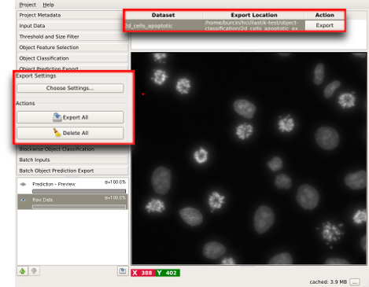
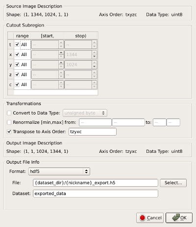

# Exporting Output

Results of various ilastik workflows can be exported for later use by
* other ilastik workflows such as using pixel classification outputs in object classification or tracking workflows or
* analysis software such as [Fiji](http://fiji.sc/Fiji).

Data export is handled through a specific step in the workflow. For example, the "Prediction Export" step in [pixel classification]({{baseurl}}/documentation/pixelclassification/pixelclassification.html) or "Density Export" step in [counting]({{baseurl}}/documentation/counting/counting.html). This is a general introduction to the options available in this interface.

## Data Export Applet

The export step is handled through the data export applet in ilastik. This applet displays a panel with three buttons on the left and a box on the top right.

The panel can be used to change export settings as well as bulk export of all the data. These buttons are availabe in the panel:
* **Choose Settings:** opens [the export settings dialog](#settings) explained below
* **Export All:** exports output for all input files based on the settings, including output file names and locations, specified in [the export settings dialog](#settings)
* **Delete All:** removes all output files

The box on the top right lists the input files using their nicknames defined in [data selection applet]({{baseurl}}/documentation/startup/dataselection.html) along with the location of the ouput file. The location can only be changed through [the export settings dialog](#settings) which can be opened with the **Choose Settings** button on the left. The **Export** button generates individual output files corresponding to the selected dataset.

## Export Settings {#settings}

