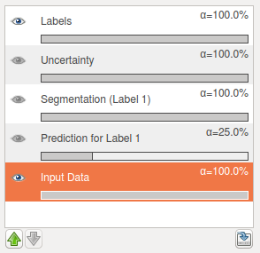

#Layers 

Most applets show a widget as below in the lower left corner:

Shown is a list of _layers_. These layers show datasets with the same
extent as the original data (Input Data), from which they were derived.
Examples are predicted pixel probabilities or segmentation.

Layers can be thought of as a stack of transparencies.
In the above example, the _Input Data_ layer comes first. On top of that,
we overlay - in this order -
_Prediction for Label 1_,
_Segmentation (Label 1) _,
_Uncertainty_, and
_Labels_.

 (visible) and
 (invisble)
shows whether this layer is visible or not. Invisible
layers are ignored.

Each layer's transparency is indicated by the gray bar below its name,
and the opacity (alpha) is shown.
100% means a fully opaque layer, while 0% means a completely transparent
layer. The amount of transparency can be changed by clicking the gray bar.

Layers can also be _reordered_ to change their position in the stack.
To do this, first highlight a layer by single click (in the example above,
the _Input Data_ layer is highlighted), then use the up/down arrows on the
lower right.

To export the data that is shown by the currently _highlighted_ layer,
press this button.

Alternatively, a layer's contextmenu (right click) can be used to access the
same layer export functionality.

The export dialog is described in
the [data export]({{site.baseurl}}/documentation/startup/export.html) section.

