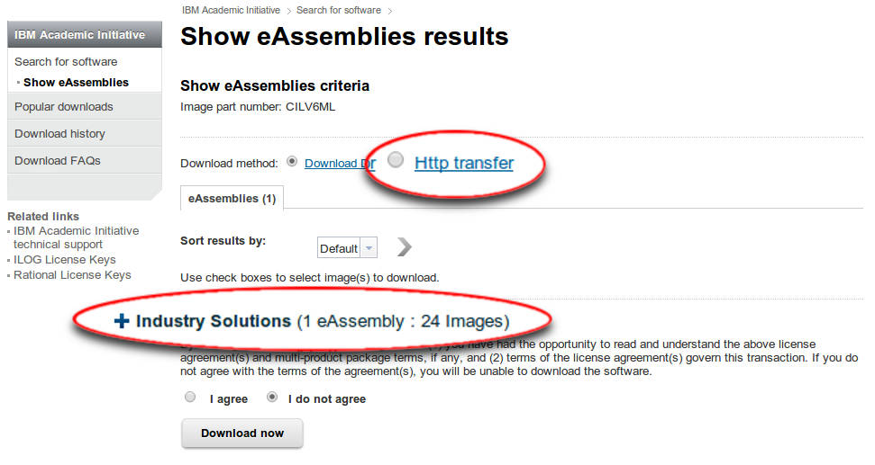
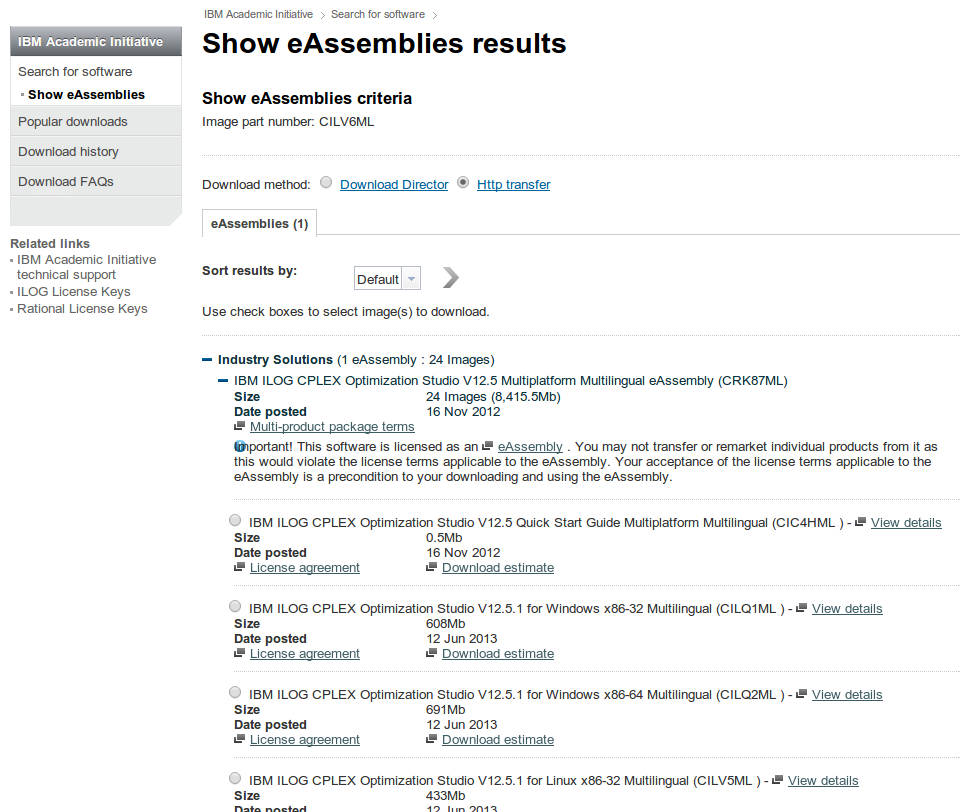

# Install CPLEX

To use the *Automatic Tracking* Workflow, it is required to install the commercial solver IBM CPLEX. 

**Note that it is not needed to install IBM CPLEX for all other ilastik workflows.**

## Application for Academic License at IBM

IBM CPLEX is a commercial solver which is free for academic use.
To apply for an academic license, the user first needs to apply for an 
academic membership at IBM. Details may be found on
[the IBM Academic Initiative website](http://www-03.ibm.com/ibm/university/academic/pub/page/membership).
Please note that it might take some days until the application gets approved by IBM.

## Download IBM CPLEX

As soon as the academic membership got approved, the user can download IBM CPLEX. To do so, 
the steps on [this IBM website](http://www-03.ibm.com/ibm/university/academic/pub/jsps/assetredirector.jsp?asset_id=1070)
may be followed. 
The search result in the IBM software catalogue should look similar to this:

We recommend to use *Http transfer*, then clicking on the CPLEX instance in *Industry Solutions* should open
a list of CPLEX versions available for different platforms:

The current version of ilastik works with 
**IBM ILOG CPLEX Optimization Studio V12.5.1**.
After choosing the appropriate platform, the user has to agree with the IBM license. 
Finally, CPLEX may be downloaded and is ready to install.

**Important note: It is not sufficient to download the Trial version of CPLEX since its solver can only handle
very small problem sizes. Please make sure, the correct version is downloaded as described here.**

##Windows

On Windows, there are typically no further modifications needed after installing CPLEX. 
After successful installation, the *Automatic Tracking Workflow* is displayed on the Start-Screen of ilastik.

If this workflow is not present, something went wrong with the CPLEX installation. As a workaround,
the user may copy the files `libcplex.dll`, `libilocplex.dll`, 
and `libconcert.dll` from the CPLEX installation directory into the library folder of ilastik, usually
located at `C:/Program Files/ilastik/lib`.

##Linux

Unfortunately, CPLEX packages do not provide shared versions of all required libraries, but only 
static variants. The user has to navigate to the installation folder of CPLEX and therein to the 
static libraries `libcplex.a`, `libilocplex.a`, and `libconcert.a` (usually located in 
`ILOG/CPLEX_Studio125/cplex/lib/x86-64_sles10_4.1/static_pic` and `ILOG/CPLEX_Studio125/concert/lib/x86-64_sles10_4.1/static_pic`)
to run the following commands:

    g++ -fpic -shared -Wl,-whole-archive libcplex.a -Wl,-no-whole-archive -o libcplex.so
    g++ -fpic -shared -Wl,-whole-archive libilocplex.a -Wl,-no-whole-archive -o libilocplex.so
    g++ -fpic -shared -Wl,-whole-archive libconcert.a -Wl,-no-whole-archive -o libconcert.so

These commands will link shared CPLEX libraries from the static versions.

Finally, these shared libraries need to be copied into the library folder of the ilastik installation,`ilastik/lib`. 

After successful installation, the *Automatic Tracking Workflow* is displayed on the Start-Screen of ilastik.

##Mac

As for Linux, CPLEX packages for Mac do not provide shared versions of all required libraries, but only 
static variants. The user has to navigate to the installation folder of CPLEX and therein to the 
static libraries `libcplex.a`, `libilocplex.a`, and `libconcert.a` (usually located in 
`ILOG/CPLEX_Studio125/cplex/lib/x86-64_sles10_4.1/static_pic` and `ILOG/CPLEX_Studio125/concert/lib/x86-64_sles10_4.1/static_pic`)
to run the following commands:

    g++ -fpic -shared -Wl,-all_load libcplex.a -Wl,-noall_load -o libcplex.dylib
    g++ -fpic -shared -Wl,-all_load libilocplex.a -Wl,-noall_load -o libilocplex.dylib
    g++ -fpic -shared -Wl,-all_load libconcert.a -Wl,-noall_load -o libconcert.dylib

These commands will link shared CPLEX libraries from the static versions.

Finally, these shared libraries need to be copied into the library folder of the ilastik installation,`ilastik/lib`. 

After successful installation, the *Automatic Tracking Workflow* is displayed on the Start-Screen of ilastik.

